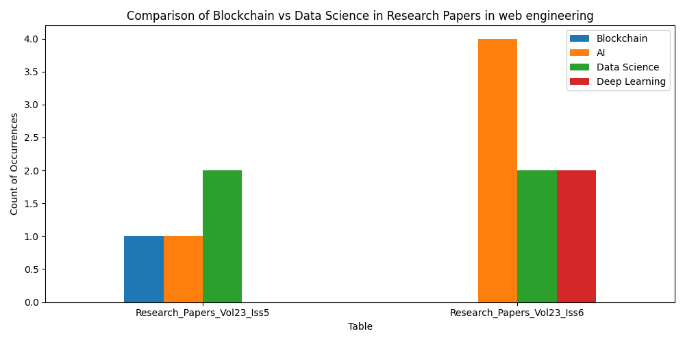

# data_extraction 

This project scrapes research titles and authors from the River Publishers website, stores them in an SQLite database, and performs an analysis to determine the prevalence of Blockchain and Data Science topics. The analysis is visualized in a bar chart that compares these topics across different research categories.

## Table of Contents :scroll:
Project Overview
Features
Setup and Installation
Usage
Output
Project Overview
This project automates the process of scraping research titles and authors from the River Publishers website, organizes them in a local SQLite database, and analyzes the data to determine if Web Engineering is more focused on Blockchain or Data Science. The results are displayed in a visual graph.

Features
Web Scraping: Extracts research titles and author information from a specific webpage.
Database Storage: Stores scraped data into an SQLite database for further processing.
Keyword Analysis: Counts occurrences of the keywords "Blockchain" and "Data Science" in the titles.
Visualization: Generates a bar chart that compares the occurrences of the two keywords.
Setup and Installation
Clone the Repository:

bash
Copy code
```
git clone https://github.com/jyothiPriyaBhuvanagiri/my_data_extraction.git
cd river_publishers_analysis
```
Install Required Packages: Make sure you have Python installed, then install required packages using:

```bash
requests for web scraping
beautifulsoup4 for parsing HTML
pandas for data handling
matplotlib for data visualization
Set Up Database: Ensure the database your_database.db is created and accessible. The project will populate tables as needed.
```


### Perform Analysis and Visualization: Run the main analysis script to compare the prevalence of Blockchain and Data Science topics:

## This script fetches the titles from both tables, counts occurrences of the keywords "Blockchain", "Data Science", "AI" and displays a bar chart.
Interpret Results: The bar chart compares the frequency of Blockchain and Data Science mentions across different research categories. This helps to understand which topic is more prominently discussed.

## Output
The output of graph.py is a bar chart comparing the keyword occurrences between "Blockchain", "Data Science","AI" topics.

Example bar chart:


## Fork the repository.
```bash
Create a new branch (git checkout -b feature-name).
Commit your changes (git commit -m "Add feature").
Push to the branch (git push origin feature-name).
Create a Pull Request.
```